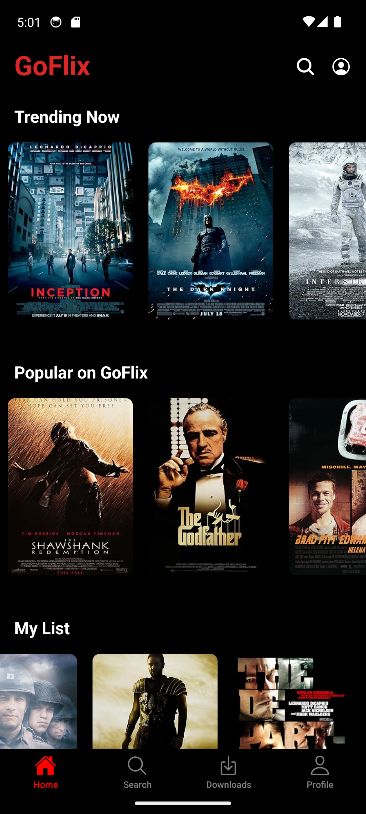
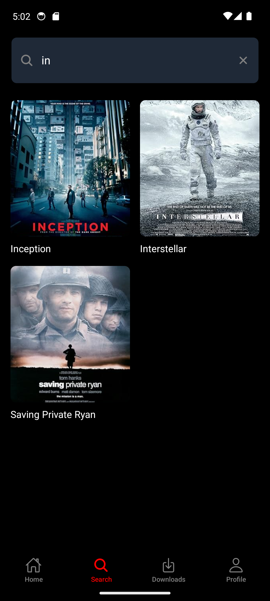
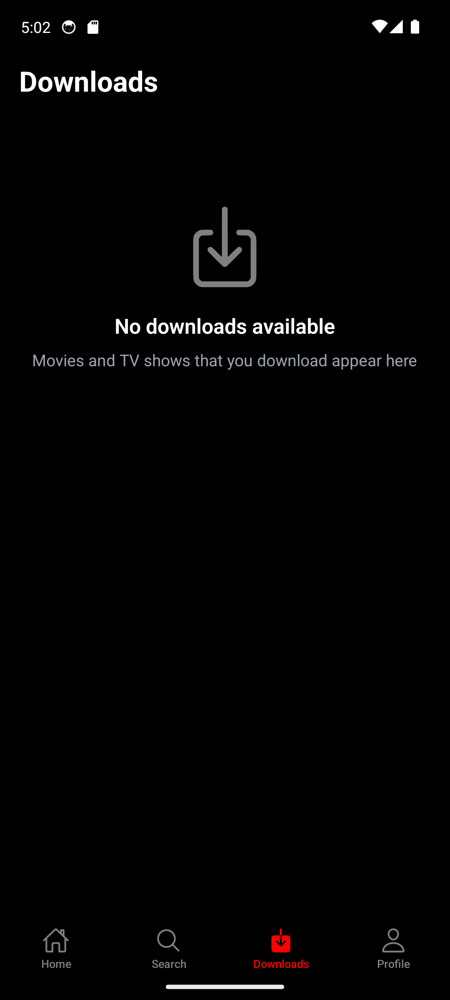
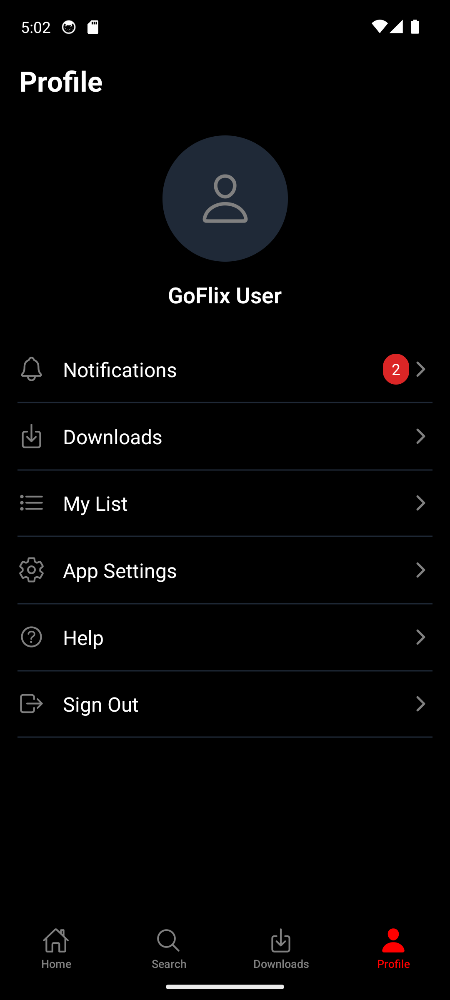
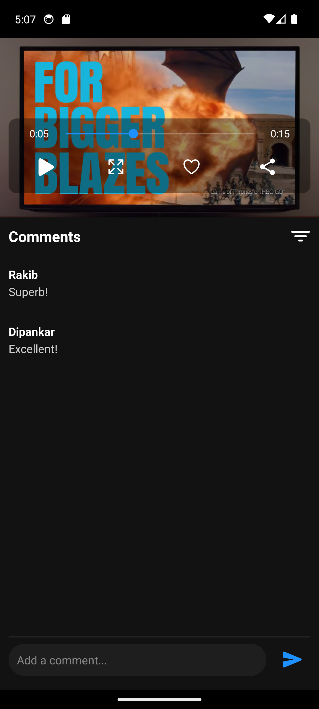

# GoFlix - Netflix Clone


GoFlix is a sophisticated mobile streaming application built with React Native and Expo, offering a Netflix-like experience. The app features a robust video player, real-time comments, offline capabilities, and a responsive design that adapts to different screen sizes.

## Core Features

### Video Streaming
- **Custom Video Player**
  - Full-screen support with orientation lock
  - Playback controls (play/pause, seek, volume)
  - Progress bar with time indicators
  - Auto-hiding controls
  - Error handling and retry mechanism

### Content Management
- **Dynamic Content Categories**
  - Trending Now
  - Popular on GoFlix
  - My List
  - New Releases
- **Search Functionality**
  - Real-time search results
  - Title-based filtering
  - Grid view for search results

### User Interaction
- **Comments System**
  - Real-time commenting
  - Comment threading
  - Author attribution
  - Timestamp tracking
- **Downloads**
  - Offline viewing capability
  - Download management
  - Storage optimization

### User Interface
- **Responsive Design**
  - Adaptive layouts
  - Dynamic scaling
  - Cross-device compatibility
- **Navigation**
  - Bottom tab navigation
  - Stack navigation for video player
  - Gesture handling

## Technical Architecture

### Frontend Stack
- **React Native & Expo**
  - Expo AV for video playback
  - React Navigation for routing
  - NativeWind for styling
  - Expo Screen Orientation for screen management

### Database Structure
json
{
  "categories": [
    {
      "id": "string",
      "title": "string",
      "movies": [
        {
          "id": "number",
          "title": "string",
          "imageUrl": "string",
          "videoUrl": "string",
          "comments": [
            {
              "id": "string",
              "author": "string",
              "text": "string"
            }
          ]
        }
      ]
    }
  ]
}
```

### Key Components
- **Video Player (`PlayerScreen.js`)**
  - Video playback management
  - Control overlay system
  - Comments integration
- **Content Lists (`MovieList.js`)**
  - Horizontal scrolling lists
  - Dynamic content loading
  - Touch interaction handling
- **Search System (`SearchScreen.js`)**
  - Real-time filtering
  - Results rendering
  - Navigation integration

## Screenshots

<div style="display: flex; flex-direction: row; flex-wrap: wrap; gap: 10px; justify-content: center">
    
    
    
    
    
</div>

## Installation

### Prerequisites
- Node.js (v14 or higher)
- Expo CLI
- Git
- Android Studio (for Android development)
- Xcode (for iOS development, Mac only)

### Setup Steps
1. **Clone Repository**
   ```bash
   git clone https://github.com/NafisRayan/GoFlix-AndroidTV.git
   cd netflix-clone
   ```

2. **Install Dependencies**
   ```bash
   npm install
   ```

3. **Run Development Server**
   ```bash
   npm start
   ```

## Project Structure
```
netflix-clone/
├── components/          # Reusable UI components
│   ├── Header.js       # App header with navigation
│   └── MovieList.js    # Movie list component
├── screens/            # Main app screens
│   ├── HomeScreen.js   # Home page
│   ├── SearchScreen.js # Search functionality
│   ├── PlayerScreen.js # Video player
│   └── ...
├── utils/             # Helper functions
│   └── dimensions.js  # Responsive scaling
├── assets/           # Static assets
├── db.json          # Local database
└── config files     # Configuration files
```

## Development Guidelines

### Styling
- Uses TailwindCSS via NativeWind
- Responsive scaling through utility functions
- Consistent color scheme and typography

### State Management
- Local state with React hooks
- Props for component communication
- Context for global state (if needed)

### Performance Optimization
- Lazy loading for video content
- Image caching
- Memoization of expensive calculations
- Efficient list rendering

## Future Enhancements
- [ ] User authentication system
- [ ] Cloud synchronization
- [ ] Personalized recommendations
- [ ] Multiple user profiles
- [ ] Advanced video analytics
- [ ] Social sharing features

## Contributing
Contributions are welcome! Please read our contributing guidelines before submitting pull requests.

## Contact
For inquiries or support, contact [nafisrayan123@gmail.com](mailto:nafisrayan123@gmail.com)
```
